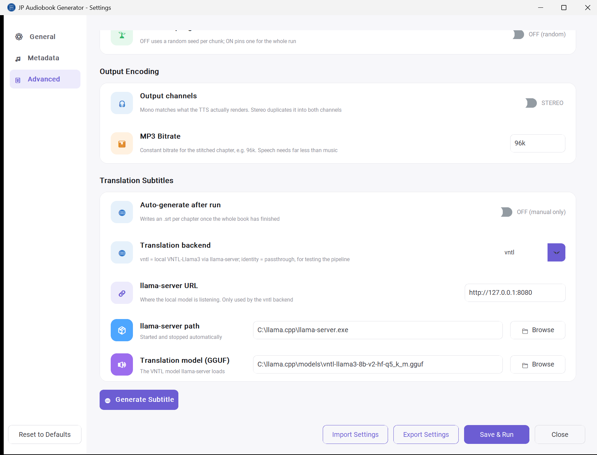
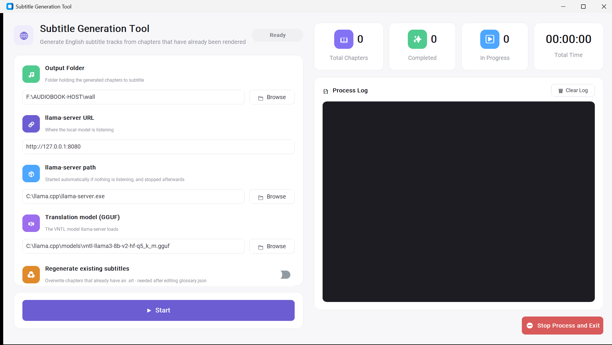

# JP-Audiobook-Generator

This script reads a raw `.txt` file and outputs an audiobook as mono AAC (`.m4a`).

# 🎧 Automated Japanese Audiobook Generator

> **⚠️ Disclaimer:** Only use this tool on text you have the legal right to
> turn into an audiobook — for example, books you've purchased for personal
> use, public-domain works, or your own writing. Generating narrated audio
> from a text doesn't remove the copyright on the underlying work.
> Redistributing or publishing audio generated from a copyrighted book
> without permission from the rights holder can create legal liability for
> you. This project does not include, host, or distribute any book content —
> it is a text-to-speech automation tool only, and responsibility for how
> it's used with any given text rests with the person running it. Input text
> is expected to come from [JP-ePub-Text-Extractor](https://github.com/hermanismail/JP-ePub-Text-Extractor)
> or a similarly legitimate source.

## 1. Project Overview

The Automated Japanese Audiobook Generator is a Python automation pipeline designed to transform Japanese text into high-fidelity audiobooks. The system utilizes the Irodori-TTS engine to facilitate a seamless transition from raw textual data to polished, human-like narration. By automating the end-to-end lifecycle — including sophisticated linguistic pre-processing, sentence-level segmentation, and hardware-accelerated synthesis — this project provides a robust solution for local audiobook production.

## 2. Core Functional Features

- **Text Pre-processing:** The pipeline parses raw Japanese text into a structured hierarchy of sections, paragraphs, and sentences. Dialogue (`「」`) and parenthetical asides (`（）`) are no longer isolated as whole, unsplittable spans - instead each bracket edge is a guaranteed silence point, while the content between/around them is chunked by the same character-count rules as ordinary narration. A mid-sentence `──` is also a forced silence point. See [Section 6](#6-detailed-text-cleaning-logic) for the full logic.
- **Sentence-Level Chunking:** To respect model token limits and prevent prosodic degradation, the script merges sentences into chunks at a configurable soft limit (100 characters by default, with a hard limit 30 above it) using `。`, `？`, `……`, and the forced break points above (`「`, `（`, `」`, `）`, `──`) as boundaries. This keeps intonation natural across long-form content (including long dialogue) while minimizing the number of TTS calls.
- **AI Speech Synthesis:** The system integrates the Irodori-TTS engine, which utilizes a Flow Matching architecture for better voice quality. Local GPU inference is managed via the `uv` package manager to ensure environment stability.
- **Automated Audio Stitching:** Using FFmpeg's concat demuxer, the script merges individual chunk waveforms into a final chapter file, inserting tiered silence gaps to simulate natural human pacing. Each gap is one of three separately configurable durations - sentence, paragraph/chapter start, or section - chosen by boundary type, with dialogue/aside edges and `──` pauses promoted to a longer gap where appropriate.
- **Per-Speaker Tuning:** Duration scale, tail trimming and the sampling seed are settings rather than constants, because trained speakers respond differently enough to them that one fixed recipe produced inconsistent results across voices. The AAC output bitrate is configurable alongside them. See [Section 7.3](#73-advanced-settings).
- **Chunk Timing Data:** Every chapter is written with a `<chapter>.sync.json` recording each chunk's start/end offset in the finished `.m4a`. It falls out of the same concat ordering used to stitch the audio, so no separate alignment pass is needed, and it is what makes read-along playback and subtitles possible. See [Section 8](#8-what-lands-in-the-output-folder).
- **English Subtitle Generation:** An optional pass translates the finished `sync.json` chunk by chunk and emits a sidecar `.srt`. Because it runs *after* the audio exists, chunk boundaries are already fixed by the rendered audio and the subtitle cannot desync. Translation runs locally against a VNTL model with no API cost. See [Section 9](#9-translation-subtitles).
- **Reproducible Runs:** Every run drops a timestamped copy of the settings it used into the output folder, so the recipe behind a book is still recoverable months later. Presets can be exported and imported per book or per speaker.

## 3. System Prerequisites

**System Requirements**

| Requirement | Details |
|---|---|
| Operating System | Windows 11 |
| GPU | NVIDIA GeForce RTX 4060 (8GB VRAM minimum) |
| Tools | FFmpeg (full-shared build — required for `libtorchcodec` DLL support), `uv` (modern Python package manager) |
| Engine | Irodori-TTS (cloned repository) |
| Model Weights | Downloaded automatically from Hugging Face — see below. You supply only a trained `.speaker.safetensors` (Semantic-DACVAE codec) |
| Optional (subtitles) | `llama-server` from [llama.cpp](https://github.com/ggml-org/llama.cpp/releases) (CUDA build matching your driver) and a VNTL GGUF model — see [Section 9](#9-translation-subtitles) |

**Model weights**

The pipeline uses the published checkpoint `Aratako/Irodori-TTS-v4.1-Small`,
passed to `infer.py` as `--hf-checkpoint`, so there is no local
`model.safetensors` to manage and no Model Path field in the GUI. It is
fetched into the Hugging Face cache on first use and reused from then on.

To pin a different checkpoint — a local file, or a quantized variant such as
`Aratako/Irodori-TTS-v4.1-Small-Quantized/int8-weight-only` — change
`MODEL_REF` at the top of `run_audiobook.py`. `checkpoint_args()` decides
between `--checkpoint` and `--hf-checkpoint` from the shape of the value, so
either form works. The two are mutually exclusive in `infer.py`, which is why
this is resolved in one place rather than left to the caller.

**Speaker setup**

You need to prepare the training manifest and perform speaker inversion — refer to the Irodori-TTS documentation. Convert your sample WAV first via the training manifest step, then train your speaker using that output:

1. [Prepare the training manifest](https://github.com/Aratako/Irodori-TTS#1-prepare-the-training-manifest)
2. [Train v4-Small](https://github.com/Aratako/Irodori-TTS#2-train-v4-small)
3. [Speaker inversion](https://github.com/Aratako/Irodori-TTS#4-speaker-inversion)

## 4. Environment Setup and GPU Verification

Follow these steps to initialize the hardware-accelerated environment:

**Environment synchronization** — install dependencies with CUDA 12.8 support from the project root:
```powershell
uv sync --extra cu128
```

**Hardware verification** — confirm the RTX 4060 is correctly mapped to PyTorch:
```powershell
uv run python -c "import torch; print('GPU Available:', torch.cuda.is_available()); print('Device Name:', torch.cuda.get_device_name(0) if torch.cuda.is_available() else 'None')"
```

## 5. Script Workflow Diagram

The following diagram visualizes the data path from ingestion to the final output:


## 6. Detailed Text Cleaning Logic

> **2026-08 rewrite note:** this section previously described a search-and-replace pass that converted `」` and `……` into commas before splitting on `。`/`？`. That approach was replaced with the structured section/paragraph/sentence pipeline below (`text_pipeline.py`), which treats dialogue and parenthetical asides as first-class boundaries instead of substituting them away.
>
> **2026-08 v2 update:** the original rewrite isolated every `「」`/`（）` span as one indivisible chunk, regardless of length. In practice some dialogue lines ran to 200+ characters (this author's writing style leans long on dialogue), producing single TTS calls far past the 130-character hard limit. v2 replaces whole-span isolation with **forced break points**: each bracket edge, and each mid-sentence `──`, guarantees a silence gap at that exact point, but the text on either side is chunked by the normal 100/130-character rules just like narration. This fixes the long-dialogue problem while keeping the original guarantee that dialogue/asides always get a silence gap around them.

The text pipeline (`text_pipeline.py`) runs in four stages: it defines sentence/paragraph/section boundaries and forced break points, splits the chapter into working files along those boundaries, merges sentences into TTS-sized input chunks, and finally drives silence insertion when the chunk audio is stitched back together.

### 6.1 Definitions

**Sentence** — text ending at `。`, `？`, or `……` (ellipsis), same as before.

**Forced break points** — four situations where the text is always cut, regardless of the 100/130-character merge rules, and a silence gap is guaranteed at that exact point:

| Trigger | Cut position | Gap tag | Break value |
|---|---|---|---|
| `「` or `（` | Immediately **before** the bracket | `bracket_open` | 1 |
| `」` or `）` | Immediately **after** the bracket | `bracket_close` | 1 |
| `──` | At the dash itself (dash is dropped from the TTS text — the model ignores it anyway, so there's no point sending it) | `dash` | 2 |

The **break value** is not a duration — it feeds the level calculation in [Section 6.5](#65-stage-4--concatenation--silence-insertion), which decides which of the three silence files ends up at that gap.

Unlike the old priority rule, brackets no longer isolate their *entire* contents as one chunk — only the two edges are forced cut points. Everything between an opening and closing bracket (and everything outside brackets) is chunked by the same character-count merge logic described in 6.3, so a long line of dialogue now gets split into several ~100-character chunks internally, just like narration would.

**Paragraph** — a run of sentences that ends with a single CRLF.

**Section** — a run of sentences that ends with more than one CRLF in a row (i.e. a blank line).

**Chapter start** — the very first chunk of every chapter gets its own guaranteed lead-in silence (the paragraph-level one), so consecutive chapters don't run into each other when played back-to-back on a playlist.

**Ordering note:** since paragraph/section boundaries are defined by CRLF patterns, boundary detection happens *before* the CRLF characters are removed — the parser reads the raw file once to mark section/paragraph/sentence boundaries, then strips whitespace/CRLF/IDSP when writing each working file's content.

**IDSP** — the ideographic space character (U+3000, full-width space).

### 6.2 Stage 1 — Parse & split into working files

Working from the original chapter `.txt` file, three passes:

1. **Section split** — find section boundaries (blank-line-separated runs), write each to `sec001.txt`, `sec002.txt`, … up to the last section.
2. **Paragraph split** — within each section, split on single-CRLF paragraph boundaries, write `sec001par001.txt`, `sec001par002.txt`, … (paragraph numbering resets to `001` at the start of each new section).
3. **Sentence split** — within each paragraph, split on sentence boundaries and forced break points, write `sec001par001sen001.txt`, `sec001par001sen002.txt`, … (sentence numbering resets to `001` at the start of each new paragraph).

All spaces, CRLFs, and IDSP are stripped from the content of every working file produced in this stage.

### 6.3 Stage 2 — Merge sentences into TTS input chunks

Goal: instead of one audio generation call per sentence, combine sentences so each TTS input lands close to the soft limit, never exceeding the hard limit where avoidable.

> The worked examples below use the defaults — a **100-character** soft limit and a **130-character** hard limit. Both follow **Max Chunk Length** on the [Advanced page](#73-advanced-settings): the hard limit is always the soft limit **+ 30**, and is not separately configurable. Lowering the soft limit gives finer control over where silence lands, at the cost of more TTS calls.

Per paragraph, walk its sentence units in order and maintain a running buffer:

0. **Forced break check first** — if the next unit immediately follows a forced break point (6.1), it never merges backward into whatever's currently buffered; the current buffer (if any) is closed out as its own chunk first, and this unit starts a brand-new buffer. That new buffer still goes through the normal merge rules below for anything added to it afterward — the forced break only guarantees the cut *before* it, not that the resulting chunk stays short.
1. Otherwise, add the next sentence to the buffer; sum its character count into the running total.
2. If the running total is **≤ 100 chars**: keep going — pull in the next sentence (repeating the forced-break check each time) and repeat step 1.
3. If the running total lands **between 100 and 130 chars**: stop here, close the chunk, save it, start a new empty buffer for the next chunk.
4. If the running total **exceeds 130 chars** (hard limit): look inside the sentence that just pushed it over 130 for a `、` (comma) split point — "whichever sentence just caused the overflow," not necessarily literally the second sentence in the buffer.
   - If a `、` is found: recalculate the total using only the portion of that sentence up to the `、`. Close the chunk with that partial sentence included. The remainder (after the `、`) becomes the start of the next chunk's buffer.
   - If no usable `、` is found (or the comma-split portion is still over 130 chars): let it exceed the 130-character hard limit and close the chunk as-is. The TTS module will still complete the sentence — it just renders the speech slightly faster than normal. This is preferred over cutting a sentence off mid-way.

Repeat until every sentence in every paragraph has been consumed.

**Output naming** (chunk numbering resets to `001` at the start of each new paragraph):
```
sec001par001input001.txt
sec001par001input002.txt
...
sec001par001input00x.txt   (last chunk of paragraph 1)
sec001par002input001.txt
...
sec00Xpar00Ninput00x.txt   (last chunk overall)
```

### 6.4 Stage 3 — TTS generation

Each `...input00x.txt` goes through the TTS pipeline and produces a matching `...input00x.wav`. Each input file represents a merged group of sentences rather than a single sentence.

### 6.5 Stage 4 — Concatenation & silence insertion

When stitching the `.wav` files back together with FFmpeg, **exactly one** silence file is inserted before each chunk. Which of the three it is depends on the tags describing the gap immediately before that chunk (6.1).

The three silence levels, each with its own pre-rendered file and its own independently configurable duration on the [Advanced Settings](#73-advanced-settings) page:

| Level | Silence kind | File inserted | Duration setting |
|---|---|---|---|
| 1 | sentence | `silence_sentence.wav` | **Sentence Silence (seconds)** |
| 2 | paragraph | `silence_paragraph.wav` | **Paragraph Silence (seconds)** |
| 3 | section | `silence_section.wav` | **Section Silence (seconds)** |

Levels are a **ranking, not a multiplier** — level 3 is not "three times level 1". The three durations are set independently, so the section gap could be 1.5s while the sentence gap is 1.0s, or all three could be identical.

Every gap always carries exactly one **structural** tag, which sets the baseline level (mutually exclusive — the highest-scoped one wins), and may additionally carry **content** tags from forced break points (additive with each other, but not with the structural baseline):

| Structural tag | Baseline level | | Content tag | Adds |
|---|---|---|---|---|
| `section` (new section) | 3 — section | | `bracket_open` | 1 |
| `paragraph` (new paragraph) | 2 — paragraph | | `bracket_close` | 1 |
| `chapter_start` (first chunk of the chapter) | 2 — paragraph | | `dash` | 2 |
| `sentence` (default, plain within-paragraph gap) | 1 — sentence | | | |

**Combination rule:** `level = MIN(3, MAX(structural baseline, sum of break values at that gap))`

A forced break point therefore never gets a *shorter* silence than the structural boundary it happens to coincide with, but content tags don't stack on top of an already-larger structural gap either, and nothing goes past the section level. Worked examples:

| Situation | Calculation | Silence inserted |
|---|---|---|
| Plain sentence gap, no bracket/dash | max(1, 0) = 1 | `silence_sentence.wav` |
| Before a `「` mid-paragraph | max(1, 1) = 1 | `silence_sentence.wav` |
| `」` immediately followed by `「` (no text between) | max(1, 1+1) = 2 | `silence_paragraph.wav` |
| A new paragraph that happens to open with `「` | max(2, 1) = 2 | `silence_paragraph.wav` |
| A `──` cut mid-paragraph | max(1, 2) = 2 | `silence_paragraph.wav` |
| First chunk of the chapter | max(2, 0) = 2 | `silence_paragraph.wav` |
| A new section | max(3, 0) = 3 | `silence_section.wav` |
| A `──` landing on a `」「` join | min(3, max(1, 2+1+1)) = 3 | `silence_section.wav` |

Silence is only inserted at chunk boundaries, not between individual sentences that got merged inside the same chunk (those are spoken as one continuous TTS render, with pacing left to the TTS module).

#### How the three silence files are produced

They are rendered **once per run**, not once per chapter, into a `_silence` subfolder of the Temp Folder. Generation is deferred until the first chunk of the first chapter exists, so FFprobe can read that chunk's real **sample rate, channel count and sample format** and match them exactly — the concat demuxer does no resampling, so any drift between the silence files and the TTS output corrupts the timing of the stitched audio. Per-chapter temp cleanup deliberately skips `_silence`; it is removed at the end of the run if **Keep temp files after run** is OFF.

The resulting `concat_list.txt` alternates strictly — one silence file, one chunk, one silence file, one chunk:

```
file 'E:\after-dark-test\_silence\silence_section.wav'
file 'E:\after-dark-test\chapter_001\sec001par001input001.wav'
file 'E:\after-dark-test\_silence\silence_sentence.wav'
file 'E:\after-dark-test\chapter_001\sec001par002input001.wav'
file 'E:\after-dark-test\_silence\silence_paragraph.wav'
file 'E:\after-dark-test\chapter_001\sec001par003input001.wav'
file 'E:\after-dark-test\_silence\silence_section.wav'
```

> **2026-08 update — one file per gap.** Earlier versions rendered a single `silence.wav` and produced longer gaps by listing that same file two or three times in a row in `concat_list.txt`, which is where the old `1×`/`2×`/`3×` notation came from. Every gap length was therefore locked to a whole multiple of one base number. The three durations are now genuinely independent and each gap references exactly one correctly-sized file. Setting them to 1.0 / 2.0 / 3.0 reproduces the old behaviour exactly.

## 7. Execution and Deployment

**Settings GUI (recommended)**

A GUI (`gui_settings.py`) is available so you no longer need to hand-edit `run_audiobook.py` or `settings.json` for routine changes. Once set up, you can open it directly from the Windows taskbar:

1. Run `Create-Shortcut.ps1` once to create a desktop shortcut pointing to `Launch-Settings-Silent.vbs`.
2. Pin that shortcut to the taskbar (right-click it → *Pin to taskbar*).
3. Click the taskbar icon anytime to open the settings window, change values, and run the program without touching the terminal.

The settings window has three tabs — General, Metadata, and Advanced — plus a shared bottom action bar.

### 7.1 General Settings

Paths and basic preferences for the audiobook generation process.


| Field / control | What it does |
| --- | --- |
| **Input Folder** | Folder containing the input chapters — `chapter_001.txt`, `chapter_002.txt`, etc. This is the `chapter_*.txt` naming that [JP-ePub-Text-Extractor](https://github.com/hermanismail/JP-ePub-Text-Extractor) writes to its output folder, so that tool's output can be pointed at directly as this one's input. |
| **Output Folder** | Where the generated `.m4a` files are saved, one per chapter. |
| **Regenerate existing chapters** | **OFF** by default: any chapter that already has audio in the Output Folder — a `.m4a`, or an `.mp3` from before the switch to AAC — is skipped, and the run says which ones and why. This replaces shuffling `.txt` files in and out of the Input Folder by hand to avoid clobbering finished work — easy to get wrong, and expensive when you do, since a chapter is hours of GPU time. Turn **ON** to rebuild and overwrite them, e.g. after finding a better recipe. It also governs subtitles on the automatic path — see [Section 9.4](#94-how-the-two-halves-stay-in-step). |
| **Temp Folder** | Where intermediate working files (split sections/paragraphs/sentences, per-chunk `.wav` files, the run log) are written during a generation run, one subfolder per chapter, plus a shared `_silence` subfolder holding the three silence `.wav` files for the run. |
| **Keep temp files after run** | **ON** by default, leaving the split text and per-chunk `.wav` working files in the Temp Folder after a run (useful for inspecting a chapter). Turn **OFF** to have them cleared once generation completes. |
| **Speaker Path** | Path to your trained `.speaker.safetensors` file, produced by the speaker inversion step (see **Speaker setup** in [Section 3](#3-system-prerequisites)). |
| **uv Project Folder** | The base folder of your Irodori-TTS `uv` project — i.e. the folder you'd normally run `uv run ...` from. Generation is launched as a subprocess inside this folder, so it needs to match wherever Irodori-TTS was cloned and synced. |

Every path field has a **Browse** button that opens a file/folder picker instead of typing the path by hand.

### 7.2 Metadata Settings

Tag chapters so Spotify (or any player that reads ID3/MP4 tags) groups them as one album.


| Field / control | What it does |
| --- | --- |
| **Author Name** | Written to the Artist / Album Artist tags on every chapter file. |
| **Book Title** | Written to the Album tag — identical across all chapters, which is what lets a player group them together. |
| **Genre** | Written to the Genre tag (defaults to "Audiobook"). |
| **Auto-number chapters** | **ON** by default. Sets each chapter's Track Number tag from the chapter's file name (`chapter_001.txt` → track 1, etc.), so playback order matches reading order. |
| **Auto-tag generated files** | **ON** by default. Automatically tags the output files with the above metadata right after generation, as part of **Save & Run** — you don't need a separate step. |
| **Cover Art** | Path to a `.jpg`/`.jpeg`/`.png` image embedded as artwork in every chapter file. **Browse** picks the file. |
| **Apply Tags to Output Files** | Re-applies the current Author/Title/Genre/Cover Art/track-number settings to whatever chapter files already exist in the Output Folder, without re-running generation. Useful after generating once and then fixing a typo in the title, for example. Writes MP4 tags to a `.m4a` and ID3v2 to an older `.mp3`, so it still works on books generated before the switch to AAC. Requires Author Name and Book Title to be filled in, and the Output Folder to already contain the files from a previous run. |

### 7.3 Advanced Settings

Fine-tune generation behavior.




The page scrolls; the two shots above are the top and bottom of it.

| Field / control | What it does |
| --- | --- |
| **Sentence Silence (seconds)** | Length of the gap inserted between sentences inside a paragraph — the shortest of the three. Defaults to 1.0 seconds; must be a positive number. |
| **Paragraph Silence (seconds)** | Length of the gap inserted between paragraphs, and as the lead-in before the very first line of a chapter. Defaults to 1.2 seconds; must be a positive number. |
| **Section Silence (seconds)** | Length of the gap inserted between sections (text separated by a blank line) — the longest of the three. Defaults to 1.5 seconds; must be a positive number. |
| **Max Chunk Length (characters)** | Soft cap on how much text is packed into one TTS chunk before starting a new one. The hard limit that the merger only crosses to avoid cutting a sentence off mid-way is always this **+ 30** characters, and is not separately configurable. Lower values give finer control over where silence lands, at the cost of more TTS calls. |

The three durations are fully independent — there is no longer a single "base unit" that the longer gaps are multiples of. Each one is rendered to its own silence `.wav` before stitching, and [Section 6.5](#65-stage-4--concatenation--silence-insertion) explains which of the three lands at any given gap. Setting all three to the same number gives uniform pacing throughout; widening only **Section Silence** gives a clearer beat between scene breaks without slowing down ordinary narration.

> **Upgrading from an earlier version:** older `settings.json` files stored one `silence_duration` value. On first load it is migrated automatically into `silence_duration_sentence` (the old value), `silence_duration_paragraph` (2× it) and `silence_duration_section` (3× it), which reproduces the previous output exactly. Nothing changes audibly until you actually edit the numbers here.

**TTS Tuning**

These are passed straight through to Irodori-TTS's `infer.py`. They are settings rather than constants because trained speakers respond to them differently enough that fixing them in code produced inconsistent results across voices — expect to tune them per speaker and export the result as a preset.

| Field / control | What it does |
| --- | --- |
| **Duration Scale** | `--duration-scale`. Multiplies the length v4-Small predicts for each chunk: above 1.0 slows the delivery, below speeds it up. Defaults to 1.2. |
| **Disable tail trimming** | `--no-trim-tail`. **ON** keeps the end of every chunk intact. Irodori's tail heuristic was written for v2's fixed 30-second outputs; on short chunks a false positive costs the final syllable. **OFF** hands trimming back to `infer.py`, at the cost of a little dead air per chunk. |
| **Fixed sampling seed** | `--seed`. **OFF** by default, letting `infer.py` draw a fresh seed per chunk. **ON** pins one seed for the whole run and reveals a value box. Reproducible, but be careful: pinning one seed means every chunk starts from the same noise, so a draw that suits some text badly then hurts every chunk it touches — in testing this made chapters noticeably *less* stable, not more. |

**Output Encoding**

| Field / control | What it does |
| --- | --- |
| **AAC Bitrate** | Bitrate for the stitched chapter, `64k` by default (accepts `64` or `64k`, 32–128). The chapter is always **mono AAC in an `.m4a`** — ffmpeg's native `aac` encoder with `-movflags +faststart`, so the index sits at the front of the file and a streaming player can start from a Range request. 64k was chosen by ear against 48k, 80k and the Windows MediaFoundation encoder when the player library was re-encoded, and comes out ~4.5× smaller than the 320k stereo MP3 this tool used to write. |

There is no channels switch any more. Irodori-TTS renders mono, and every stereo file this tool produced measured as dual mono (the L−R difference is −91 dB, i.e. digital silence), so stereo only ever split the bitrate across two identical channels.

> **Upgrading from an MP3 version:** older settings files carry `mp3_bitrate` / `mp3_mono`. Those are ignored rather than carried over — a value chosen for stereo MP3 (often 320k) means nothing for AAC — and the next **Save & Run** drops them. Existing `.mp3` chapters still count as finished and are not re-rendered; the player accepts both containers and prefers `.m4a`, and the player repo's `npm run publish -- --reencode` converts an old book in seconds.

**Translation Subtitles**

Covered in full in [Section 9](#9-translation-subtitles).

| Field / control | What it does |
| --- | --- |
| **Auto-generate after run** | **OFF** by default. **ON** runs subtitle generation once at the very end of a whole book — not per chapter, since a translation model and Irodori-TTS would contend for the same 8GB card. Turning this on greys out the manual **Generate Subtitle** button, since translation then happens by itself. |
| **Translation backend** | `vntl` (local VNTL-Llama3 via llama-server) or `identity`, which passes the Japanese through untranslated. `identity` is the control case for checking the artifact format and player round-trip with no model in the loop. |
| **llama-server URL** | Where the local model listens. Only used by the `vntl` backend. |
| **llama-server path** | The `llama-server.exe` to start when nothing is already listening. It is stopped again when translation finishes, so the GPU is only occupied while the job runs. |
| **Translation model (GGUF)** | The VNTL model `llama-server` loads. |
| **Generate Subtitle** | Opens the Subtitle Generation Tool ([Section 9.3](#93-the-subtitle-generation-tool)). Greyed out while **Auto-generate after run** is ON. |

### 7.4 Bottom action bar

Present on every tab.

| Button | What it does |
| --- | --- |
| **Reset to Defaults** | After a confirmation prompt, resets every field on all three tabs back to its built-in default value. Nothing is written to `settings.json` until you also click **Export Settings** or **Save & Run**. |
| **Import Settings** | Loads a preset `.json` chosen through a file picker into the form. Keys the file doesn't contain are left at their defaults, so an older or hand-trimmed preset still loads, and a legacy single `silence_duration` is migrated the same way `settings.json` is. Nothing is written anywhere until you then Export or Save & Run. |
| **Export Settings** | Writes the current values to a preset file of your choosing, named after the Book Title by default. This **does not** touch `settings.json` — presets are per book or per speaker, while `settings.json` is the working config the pipeline reads. A [run snapshot](#8-what-lands-in-the-output-folder) is itself a valid preset, so "reproduce that book's settings" is Import → pick the snapshot → Save & Run. |
| **Save & Run** | Validates, writes `settings.json`, then launches `run_audiobook.py` as a background process and opens the progress window (see below). Counts the chapters it actually intends to build — applying the **Regenerate existing chapters** rule — so the progress window doesn't promise "Chapter 1 of 18" for a run that means to build three. Says so plainly if every chapter is already generated. |
| **Close** | Closes the settings window. (A run already in progress keeps going in its own progress window.) |

### 7.5 Progress window

Opens automatically after **Save & Run**, and reflects the live output of `run_audiobook.py` as it processes each chapter.

**While running:**


**After completion:**


| Element | What it shows |
| --- | --- |
| Status banner (**In Progress** / **Completed** / **Cancelled** / **Failed**) | Overall run status, with a short one-line summary underneath (e.g. "Please wait while chapters are being processed." / "All chapters have been processed successfully."). |
| Chapter progress bar | "Chapter *N* of *Total*", the chapter currently being processed (e.g. `Processing: chapter_002`), and a percent-complete bar for the TTS chunks within that chapter. |
| **Total Chapters** | Total number of `chapter_*.txt` files found in the Input Folder for this run. |
| **Completed** | How many chapters have finished generating and been saved as `.m4a` so far. |
| **In Progress** | Whether a chapter is currently being processed right now (1 while generating, 0 once idle/finished). |
| **Elapsed Time** / **Total Time** | Wall-clock time since the run started; labeled "Elapsed Time" while running and "Total Time" once the run finishes. |
| **Process Log** | Scrolling, timestamped log of each step — chapter start, section/paragraph/chunk counts, per-chunk generation progress with its silence-gap tags, chapter completion, temp-file cleanup, and auto-tagging status. Errors and failures are highlighted. **Clear Log** clears this panel only (doesn't affect output files or the underlying log file in the Temp Folder). |
| **Cancel** (while running) | Stops the run. Kills `run_audiobook.py` and any child processes it spawned (TTS inference, FFmpeg), so nothing keeps running as an orphan process in the background. |
| **Open Output Folder** (after completion) | Opens the Output Folder in File Explorer so you can listen to the generated chapters right away. |
| **Close** | Closes the progress window. |

**Running from CLI**

You have the option to run via a PowerShell terminal, and can change settings manually by editing `settings.json`. Execute the automation script via the terminal using the execution guard:

```powershell
uv run --no-sync python run_audiobook.py
```

## 8. What lands in the output folder

Per chapter:

| File | Written by | What it is |
| --- | --- | --- |
| `chapter_001.m4a` | `run_audiobook.py` | The stitched chapter: mono AAC, faststart, tagged (title/artist/album/cover as MP4 atoms) if auto-tagging is on. |
| `chapter_001.sync.json` | `run_audiobook.py` | `{version, chunks:[{index, start, end, text}]}` — each chunk's start/end offset in seconds within the finished `.m4a`, plus its **original** wording (not the TTS-normalized text). Produced by walking the same concat ordering used to stitch the audio and summing `ffprobe`'d durations, so the timings are correct by construction with no alignment pass. |
| `chapter_001.translation.json` | `translate_pipeline.py` | The translation artifact and source of truth: every chunk's index, timing, Japanese and English. Hand-editable. |
| `chapter_001.srt` | `translate_pipeline.py` | One cue per chunk, UTF-8 with no BOM, `HH:MM:SS,mmm`. Cheaply re-emitted from the `.translation.json` above. |

Per book:

| File | What it is |
| --- | --- |
| `glossary.json` | Character names, genders and aliases for translation. Hand-edited; see [Section 9.2](#92-the-glossary). |
| `<foldername>_YYYYMMDD_HHMM.json` | A snapshot of the settings that run used, written **before** the first chapter so a run that dies halfway still leaves a record of what it was attempting. Named after the output folder to stay ASCII and sortable. Everything outside the `_run` block is a faithful copy of `settings.json`, which means the snapshot can be fed straight back through **Import Settings**. |

The snapshot exists because the number of tunables has grown past what anyone
reliably remembers. Listening to a book six months later and wanting to know
which preset produced it is the whole point.

## 9. Translation subtitles

Optional. Generates an English `.srt` per chapter so a player can show a
translation alongside the Japanese reading text.

### 9.1 Why it runs after the audio

Translation reads the finished `sync.json`, never the raw text. By the time
that file exists the chunk boundaries are already fixed by the rendered audio,
so the subtitle's timing is correct by construction and cannot drift. The
alternative — translating first and chunking both languages together —
assumes a 1:1 Japanese↔English segment mapping that Japanese word order makes
fictional.

The rule that keeps it honest: **a chunk's index is sacred.** Text is only
ever filled in per existing index; chunks are never merged, split or re-timed.
That is enforced structurally rather than by checking a model's response — the
driver zips backend output positionally onto `sync.json`'s own chunk list, and
a backend returning the wrong count is rejected before anything is written.

### 9.2 The glossary

`glossary.json`, beside the chapters, reloaded at the start of every chapter:

```json
{
  "characters": [
    {"name": "ターニャ・デグレチャフ", "en": "Tanya Degurechaff",
     "gender": "Female", "aliases": "デグレチャフ少尉"}
  ],
  "notes": ["[note] Keep the register literary rather than colloquial."]
}
```

`name` must match the text exactly, `en` is the spelling you want used
consistently, and `gender` fixes pronouns that Japanese leaves implicit —
without it the model guesses from context and gets it wrong. It travels in
every prompt regardless of how far into a chapter the model has read, which is
why names stay consistent where a rolling context window alone would not.

Editing the glossary is the main reason to re-run, so turn on **Regenerate
existing subtitles** in the tool when you do — otherwise chapters that already
have an `.srt` are skipped and nothing changes.

### 9.3 The Subtitle Generation Tool

Opened from **Generate Subtitle** on the Advanced page. Two columns: what you
set before a run on the left, what you watch during one on the right.



- **Parameters** — output folder, server URL, server path, model — are editable before a run and read-only once it starts. Output Folder being overridable is the point: a different, already-generated book can be subtitled without disturbing the main settings.
- **Start / Pause / Resume / Exit** is one button whose label follows the state, next to a Ready / In Progress / Completed / Error pill.
- **Pause** is the reason the window exists. Translation saturates the GPU; pausing hands the desktop back without losing progress, and deliberately leaves `llama-server` loaded so resuming is instant.
- **Stop Process and Exit** is the emergency stop: it confirms first, cancels the run, waits for `llama-server` to shut down so the VRAM is genuinely released, and only then closes. The window's X button behaves the same way while a run is in flight.
- Chapters that already have an `.srt` are skipped and logged, since that subtitle may have been corrected by hand. Chapters with no `.sync.json` are warned about and skipped.

`llama-server` is started on demand when nothing is already listening, and
stopped again afterwards — the 8GB card holds the TTS model or the translation
model, not both. A server you started yourself is detected, used as-is and
left running.

### 9.4 How the two halves stay in step

On the automatic path (**Auto-generate after run**), the chapter decision
drives the subtitle decision: **Regenerate existing chapters** OFF means
existing `.srt` files are skipped too, ON means both are rebuilt.

This is a correctness matter, not just tidiness. Regenerating a chapter
rewrites its `sync.json`, and an `.srt` is timed against that file — keeping
the old subtitle would leave cues pointing at audio that has moved. In the
other direction, a skipped chapter's audio and subtitle are both still valid,
so re-translating would spend GPU hours arriving back where it started and
would silently discard any hand correction on the way.

### 9.5 Model setup

The pipeline is built for [VNTL-Llama3-8B-v2](https://huggingface.co/lmg-anon/vntl-llama3-8b-v2-gguf),
a fine-tune trained specifically on Japanese→English translation. It runs
locally with no API cost.

1. Download a Windows CUDA build of `llama-server` from [llama.cpp releases](https://github.com/ggml-org/llama.cpp/releases), matching your driver's CUDA version. The CUDA runtime DLLs are a **separate** `cudart-*` zip in the same release — without them the binary reports no devices.
2. Download a VNTL GGUF. `q5_k_m` (~5.7 GB) fits an 8GB card alongside an 8k context.
3. Point **llama-server path** and **Translation model (GGUF)** at them on the Advanced page.

VNTL is a completion model, not an instruction-following one, so it is driven
one chunk at a time rather than in indexed batches — which is what makes
misalignment impossible, since the model never sees an index. Its prompt uses
custom `Metadata` / `Japanese` / `English` header roles that no
chat-completions API can express, so the adapter talks to `/completion` with a
raw string. Temperature 0, no repetition penalty, per the model author: a
repetition penalty punishes the legitimately recurring tokens translation
depends on and pushes the model into renaming or omitting them.

> **Fit matters.** VNTL is trained on visual novels. Sampling 20 chunks with
> `--limit 20` before committing to a book is worth the minute it costs,
> particularly for literary prose, which is further from its training
> distribution.

**Running translation from the CLI**

```powershell
uv run --project . --no-sync python translate_pipeline.py --all --backend vntl
```

`--chapter <base>` for one chapter, `--limit N` to sample the first N chunks,
`--regenerate` to overwrite existing `.srt` files, and `--srt-only` to
re-emit subtitles from existing `.translation.json` files after correcting one
by hand.
