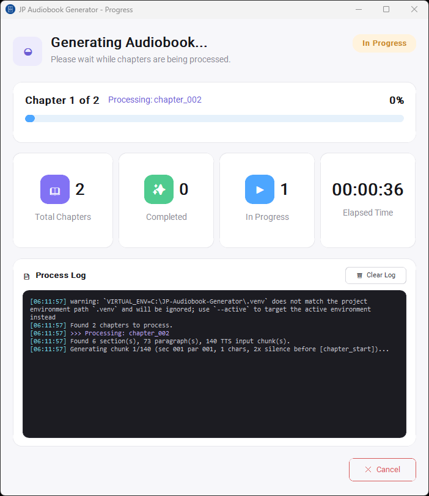
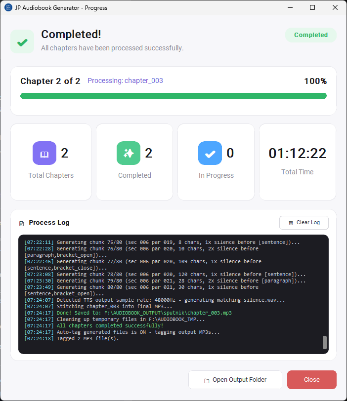

# JP-Audiobook-Generator

This script reads a raw `.txt` file and outputs an audiobook in MP3 format.

# 🎧 Automated Japanese Audiobook Generator

> **⚠️ Disclaimer:** Only use this tool on text you have the legal right to
> turn into an audiobook — for example, books you've purchased for personal
> use, public-domain works, or your own writing. Generating narrated audio
> from a text doesn't remove the copyright on the underlying work.
> Redistributing or publishing audio generated from a copyrighted book
> without permission from the rights holder can create legal liability for
> you. This project does not include, host, or distribute any book content —
> it is a text-to-speech automation tool only, and responsibility for how
> it's used with any given text rests with the person running it. Input text
> is expected to come from [JP-ePub-Text-Extractor](https://github.com/hermanismail/JP-ePub-Text-Extractor)
> or a similarly legitimate source.

## 1. Project Overview

The Automated Japanese Audiobook Generator is a Python automation pipeline designed to transform Japanese text into high-fidelity audiobooks. The system utilizes the Irodori-TTS engine to facilitate a seamless transition from raw textual data to polished, human-like narration. By automating the end-to-end lifecycle — including sophisticated linguistic pre-processing, sentence-level segmentation, and hardware-accelerated synthesis — this project provides a robust solution for local audiobook production.

## 2. Core Functional Features

- **Text Pre-processing:** The pipeline parses raw Japanese text into a structured hierarchy of sections, paragraphs, and sentences. Dialogue (`「」`) and parenthetical asides (`（）`) are no longer isolated as whole, unsplittable spans - instead each bracket edge is a guaranteed silence point, while the content between/around them is chunked by the same character-count rules as ordinary narration. A mid-sentence `──` is also a forced silence point. See [Section 6](#6-detailed-text-cleaning-logic) for the full logic.
- **Sentence-Level Chunking:** To respect model token limits and prevent prosodic degradation, the script merges sentences into ~100-character chunks (130-character hard limit) using `。`, `？`, `……`, and the forced break points above (`「`, `（`, `」`, `）`, `──`) as boundaries. This keeps intonation natural across long-form content (including long dialogue) while minimizing the number of TTS calls.
- **AI Speech Synthesis:** The system integrates the Irodori-TTS engine, which utilizes a Flow Matching architecture for better voice quality. Local GPU inference is managed via the `uv` package manager to ensure environment stability.
- **Automated Audio Stitching:** Using FFmpeg's concat demuxer, the script merges individual chunk waveforms into a final chapter file, inserting tiered silence gaps (1×/2×/3×, scaled by boundary type - sentence, paragraph/chapter start, or section - plus extra gaps around dialogue/asides and `──` pauses) to simulate natural human pacing.

## 3. System Prerequisites

**System Requirements**

| Requirement | Details |
|---|---|
| Operating System | Windows 11 |
| GPU | NVIDIA GeForce RTX 4060 (8GB VRAM minimum) |
| Tools | FFmpeg (full-shared build — required for `libtorchcodec` DLL support), `uv` (modern Python package manager) |
| Engine | Irodori-TTS (cloned repository) |
| Model Weights | `model.safetensors` (v4-Small recommended) and a trained `.speaker.safetensors` (Semantic-DACVAE codec) |

**Speaker setup**

You need to prepare the training manifest and perform speaker inversion — refer to the Irodori-TTS documentation. Convert your sample WAV first via the training manifest step, then train your speaker using that output:

1. [Prepare the training manifest](https://github.com/Aratako/Irodori-TTS#1-prepare-the-training-manifest)
2. [Train v4-Small](https://github.com/Aratako/Irodori-TTS#2-train-v4-small)
3. [Speaker inversion](https://github.com/Aratako/Irodori-TTS#4-speaker-inversion)

## 4. Environment Setup and GPU Verification

Follow these steps to initialize the hardware-accelerated environment:

**Environment synchronization** — install dependencies with CUDA 12.8 support from the project root:
```powershell
uv sync --extra cu128
```

**Hardware verification** — confirm the RTX 4060 is correctly mapped to PyTorch:
```powershell
uv run python -c "import torch; print('GPU Available:', torch.cuda.is_available()); print('Device Name:', torch.cuda.get_device_name(0) if torch.cuda.is_available() else 'None')"
```

## 5. Script Workflow Diagram

The following diagram visualizes the data path from ingestion to the final output:


## 6. Detailed Text Cleaning Logic

> **2026-08 rewrite note:** this section previously described a search-and-replace pass that converted `」` and `……` into commas before splitting on `。`/`？`. That approach was replaced with the structured section/paragraph/sentence pipeline below (`text_pipeline.py`), which treats dialogue and parenthetical asides as first-class boundaries instead of substituting them away.
>
> **2026-08 v2 update:** the original rewrite isolated every `「」`/`（）` span as one indivisible chunk, regardless of length. In practice some dialogue lines ran to 200+ characters (this author's writing style leans long on dialogue), producing single TTS calls far past the 130-character hard limit. v2 replaces whole-span isolation with **forced break points**: each bracket edge, and each mid-sentence `──`, guarantees a silence gap at that exact point, but the text on either side is chunked by the normal 100/130-character rules just like narration. This fixes the long-dialogue problem while keeping the original guarantee that dialogue/asides always get a silence gap around them.

The text pipeline (`text_pipeline.py`) runs in four stages: it defines sentence/paragraph/section boundaries and forced break points, splits the chapter into working files along those boundaries, merges sentences into TTS-sized input chunks, and finally drives silence insertion when the chunk audio is stitched back together.

### 6.1 Definitions

**Sentence** — text ending at `。`, `？`, or `……` (ellipsis), same as before.

**Forced break points** — four situations where the text is always cut, regardless of the 100/130-character merge rules, and a silence gap is guaranteed at that exact point:

| Trigger | Cut position | Gap tag | Silence weight |
|---|---|---|---|
| `「` or `（` | Immediately **before** the bracket | `bracket_open` | 1× |
| `」` or `）` | Immediately **after** the bracket | `bracket_close` | 1× |
| `──` | At the dash itself (dash is dropped from the TTS text — the model ignores it anyway, so there's no point sending it) | `dash` | 2× |

Unlike the old priority rule, brackets no longer isolate their *entire* contents as one chunk — only the two edges are forced cut points. Everything between an opening and closing bracket (and everything outside brackets) is chunked by the same character-count merge logic described in 6.3, so a long line of dialogue now gets split into several ~100-character chunks internally, just like narration would.

**Paragraph** — a run of sentences that ends with a single CRLF.

**Section** — a run of sentences that ends with more than one CRLF in a row (i.e. a blank line).

**Chapter start** — the very first chunk of every chapter gets its own guaranteed lead-in silence (2×), so consecutive chapters don't run into each other when played back-to-back on a playlist.

**Ordering note:** since paragraph/section boundaries are defined by CRLF patterns, boundary detection happens *before* the CRLF characters are removed — the parser reads the raw file once to mark section/paragraph/sentence boundaries, then strips whitespace/CRLF/IDSP when writing each working file's content.

**IDSP** — the ideographic space character (U+3000, full-width space).

### 6.2 Stage 1 — Parse & split into working files

Working from the original chapter `.txt` file, three passes:

1. **Section split** — find section boundaries (blank-line-separated runs), write each to `sec001.txt`, `sec002.txt`, … up to the last section.
2. **Paragraph split** — within each section, split on single-CRLF paragraph boundaries, write `sec001par001.txt`, `sec001par002.txt`, … (paragraph numbering resets to `001` at the start of each new section).
3. **Sentence split** — within each paragraph, split on sentence boundaries and forced break points, write `sec001par001sen001.txt`, `sec001par001sen002.txt`, … (sentence numbering resets to `001` at the start of each new paragraph).

All spaces, CRLFs, and IDSP are stripped from the content of every working file produced in this stage.

### 6.3 Stage 2 — Merge sentences into TTS input chunks

Goal: instead of one audio generation call per sentence, combine sentences so each TTS input lands close to **100 characters**, never exceeding a **130-character hard limit** where avoidable.

Per paragraph, walk its sentence units in order and maintain a running buffer:

0. **Forced break check first** — if the next unit immediately follows a forced break point (6.1), it never merges backward into whatever's currently buffered; the current buffer (if any) is closed out as its own chunk first, and this unit starts a brand-new buffer. That new buffer still goes through the normal merge rules below for anything added to it afterward — the forced break only guarantees the cut *before* it, not that the resulting chunk stays short.
1. Otherwise, add the next sentence to the buffer; sum its character count into the running total.
2. If the running total is **≤ 100 chars**: keep going — pull in the next sentence (repeating the forced-break check each time) and repeat step 1.
3. If the running total lands **between 100 and 130 chars**: stop here, close the chunk, save it, start a new empty buffer for the next chunk.
4. If the running total **exceeds 130 chars** (hard limit): look inside the sentence that just pushed it over 130 for a `、` (comma) split point — "whichever sentence just caused the overflow," not necessarily literally the second sentence in the buffer.
   - If a `、` is found: recalculate the total using only the portion of that sentence up to the `、`. Close the chunk with that partial sentence included. The remainder (after the `、`) becomes the start of the next chunk's buffer.
   - If no usable `、` is found (or the comma-split portion is still over 130 chars): let it exceed the 130-character hard limit and close the chunk as-is. The TTS module will still complete the sentence — it just renders the speech slightly faster than normal. This is preferred over cutting a sentence off mid-way.

Repeat until every sentence in every paragraph has been consumed.

**Output naming** (chunk numbering resets to `001` at the start of each new paragraph):
```
sec001par001input001.txt
sec001par001input002.txt
...
sec001par001input00x.txt   (last chunk of paragraph 1)
sec001par002input001.txt
...
sec00Xpar00Ninput00x.txt   (last chunk overall)
```

### 6.4 Stage 3 — TTS generation

Each `...input00x.txt` goes through the TTS pipeline and produces a matching `...input00x.wav`. Each input file represents a merged group of sentences rather than a single sentence.

### 6.5 Stage 4 — Concatenation & silence insertion

When stitching the `.wav` files back together with FFmpeg, silence is inserted before each chunk based on the tags describing the gap immediately before it (6.1). Every gap always has exactly one **structural** tag (mutually exclusive, highest-scoped one wins) and may additionally carry **content** tags from forced break points (additive with each other, but not with the structural tag):

| Structural tag | Weight | | Content tag | Weight |
|---|---|---|---|---|
| `section` (new section) | 3× | | `bracket_open` | 1× |
| `paragraph` (new paragraph) | 2× | | `bracket_close` | 1× |
| `chapter_start` (first chunk of the chapter) | 2× | | `dash` | 2× |
| `sentence` (default, plain within-paragraph gap) | 1× | | | |

**Combination rule:** `silence units = MAX(structural weight, sum of content weights present at that gap)`. In practice this means a forced break point never gets *less* silence than the structural boundary it happens to coincide with, but content tags don't stack on top of an already-larger structural gap either. Worked examples:

| Situation | Result |
|---|---|
| Plain sentence gap, no bracket/dash | 1× |
| Before a `「` mid-paragraph | max(1, 1) = **1×** |
| `」` immediately followed by `「` (no text between) | max(1, 1+1) = **2×** |
| A new paragraph that happens to open with `「` | max(2, 1) = **2×** |
| A `──` cut mid-paragraph | max(1, 2) = **2×** |
| First chunk of the chapter | max(2, 0) = **2×** |

Silence is only inserted at chunk boundaries, not between individual sentences that got merged inside the same chunk (those are spoken as one continuous TTS render, with pacing left to the TTS module).

## 7. Execution and Deployment

**Settings GUI (recommended)**

A GUI (`gui_settings.py`) is available so you no longer need to hand-edit `run_audiobook.py` or `settings.json` for routine changes. Once set up, you can open it directly from the Windows taskbar:

1. Run `Create-Shortcut.ps1` once to create a desktop shortcut pointing to `Launch-Settings-Silent.vbs`.
2. Pin that shortcut to the taskbar (right-click it → *Pin to taskbar*).
3. Click the taskbar icon anytime to open the settings window, change values, and run the program without touching the terminal.

The settings window has three tabs — General, Metadata, and Advanced — plus a shared bottom action bar.

### 7.1 General Settings

Paths and basic preferences for the audiobook generation process.


| Field / control | What it does |
| --- | --- |
| **Input Folder** | Folder containing the input chapters — `chapter_001.txt`, `chapter_002.txt`, etc. This is the `chapter_*.txt` naming that [JP-ePub-Text-Extractor](https://github.com/hermanismail/JP-ePub-Text-Extractor) writes to its output folder, so that tool's output can be pointed at directly as this one's input. |
| **Output Folder** | Where the generated MP3 files are saved, one per chapter. |
| **Temp Folder** | Where intermediate working files (split sections/paragraphs/sentences, per-chunk `.wav` files, the run log) are written during a generation run. See **Keep temp files after run** (Advanced) for whether these are cleaned up afterward. |
| **Model Path** | Path to the Irodori-TTS `model.safetensors` weights file (see [Section 3](#3-system-prerequisites)). |
| **Speaker Path** | Path to your trained `.speaker.safetensors` file, produced by the speaker inversion step (see **Speaker setup** in [Section 3](#3-system-prerequisites)). |
| **uv Project Folder** | The base folder of your Irodori-TTS `uv` project — i.e. the folder you'd normally run `uv run ...` from. Generation is launched as a subprocess inside this folder, so it needs to match wherever Irodori-TTS was cloned and synced. |

Every path field has a **Browse** button that opens a file/folder picker instead of typing the path by hand.

### 7.2 Metadata Settings

Tag chapters so Spotify (or any player that reads ID3/MP4 tags) groups them as one album.


| Field / control | What it does |
| --- | --- |
| **Author Name** | Written to the Artist / Album Artist tags on every chapter's MP3. |
| **Book Title** | Written to the Album tag — identical across all chapters, which is what lets a player group them together. |
| **Genre** | Written to the Genre tag (defaults to "Audiobook"). |
| **Auto-number chapters** | **ON** by default. Sets each MP3's Track Number tag from the chapter's file name (`chapter_001.txt` → track 1, etc.), so playback order matches reading order. |
| **Auto-tag generated files** | **ON** by default. Automatically tags the output MP3s with the above metadata right after generation, as part of **Save & Run** — you don't need a separate step. |
| **Cover Art** | Path to a `.jpg`/`.jpeg`/`.png` image embedded as artwork in every chapter's MP3. **Browse** picks the file. |
| **Apply Tags to Output MP3s** | Re-applies the current Author/Title/Genre/Cover Art/track-number settings to whatever MP3s already exist in the Output Folder, without re-running generation. Useful after generating once and then fixing a typo in the title, for example. Requires Author Name and Book Title to be filled in, and the Output Folder to already contain the MP3s from a previous run. |

### 7.3 Advanced Settings

Fine-tune generation behavior.


| Field / control | What it does |
| --- | --- |
| **Silence Duration (seconds)** | The base unit (1×) used for the tiered silence gaps described in [Section 6.5](#65-stage-4--concatenation--silence-insertion) — e.g. a 2× gap is twice this value. Defaults to 1.0 seconds; must be a positive number. |
| **Keep temp files after run** | **ON** by default, meaning the split section/paragraph/sentence files and per-chunk `.wav` files in the Temp Folder are left on disk after a run finishes (useful for inspecting/debugging a chapter). Turn **OFF** to have them deleted automatically once generation completes. |

### 7.4 Bottom action bar

Present on every tab.

| Button | What it does |
| --- | --- |
| **Reset to Defaults** | After a confirmation prompt, resets every field on all three tabs back to its built-in default value. Nothing is written to `settings.json` until you also click **Save Settings** or **Save & Run**. |
| **Save Settings** | Validates the current values and writes them to `settings.json`, without starting a run. |
| **Save & Run** | Validates and saves the same as above, then launches `run_audiobook.py` as a background process and opens the progress window (see below). Counts the `chapter_*.txt` files in the Input Folder up front so the progress window can show "Chapter 1 of N" immediately; refuses to start if none are found. |
| **Close** | Closes the settings window. (A run already in progress keeps going in its own progress window.) |

### 7.5 Progress window

Opens automatically after **Save & Run**, and reflects the live output of `run_audiobook.py` as it processes each chapter.

**While running:**



**After completion:**



| Element | What it shows |
| --- | --- |
| Status banner (**In Progress** / **Completed** / **Cancelled** / **Failed**) | Overall run status, with a short one-line summary underneath (e.g. "Please wait while chapters are being processed." / "All chapters have been processed successfully."). |
| Chapter progress bar | "Chapter *N* of *Total*", the chapter currently being processed (e.g. `Processing: chapter_002`), and a percent-complete bar for the TTS chunks within that chapter. |
| **Total Chapters** | Total number of `chapter_*.txt` files found in the Input Folder for this run. |
| **Completed** | How many chapters have finished generating and been saved as MP3 so far. |
| **In Progress** | Whether a chapter is currently being processed right now (1 while generating, 0 once idle/finished). |
| **Elapsed Time** / **Total Time** | Wall-clock time since the run started; labeled "Elapsed Time" while running and "Total Time" once the run finishes. |
| **Process Log** | Scrolling, timestamped log of each step — chapter start, section/paragraph/chunk counts, per-chunk generation progress with its silence-gap tags, chapter completion, temp-file cleanup, and auto-tagging status. Errors and failures are highlighted. **Clear Log** clears this panel only (doesn't affect output files or the underlying log file in the Temp Folder). |
| **Cancel** (while running) | Stops the run. Kills `run_audiobook.py` and any child processes it spawned (TTS inference, FFmpeg), so nothing keeps running as an orphan process in the background. |
| **Open Output Folder** (after completion) | Opens the Output Folder in File Explorer so you can listen to the generated MP3s right away. |
| **Close** | Closes the progress window. |

**Running from CLI**

You have the option to run via a PowerShell terminal, and can change settings manually by editing `settings.json`. Execute the automation script via the terminal using the execution guard:

```powershell
uv run --no-sync python run_audiobook.py
```
