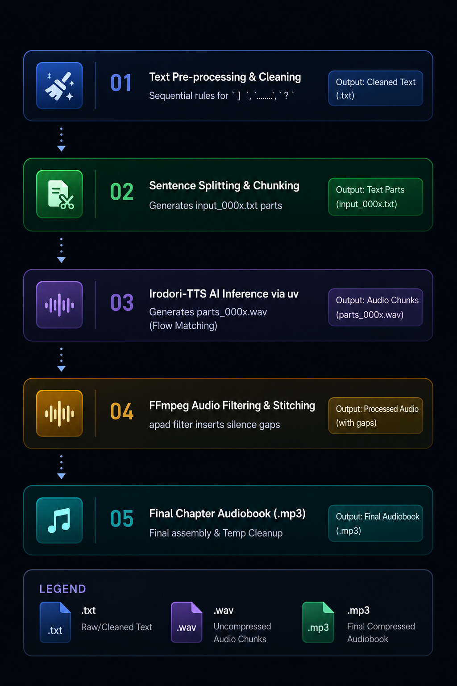
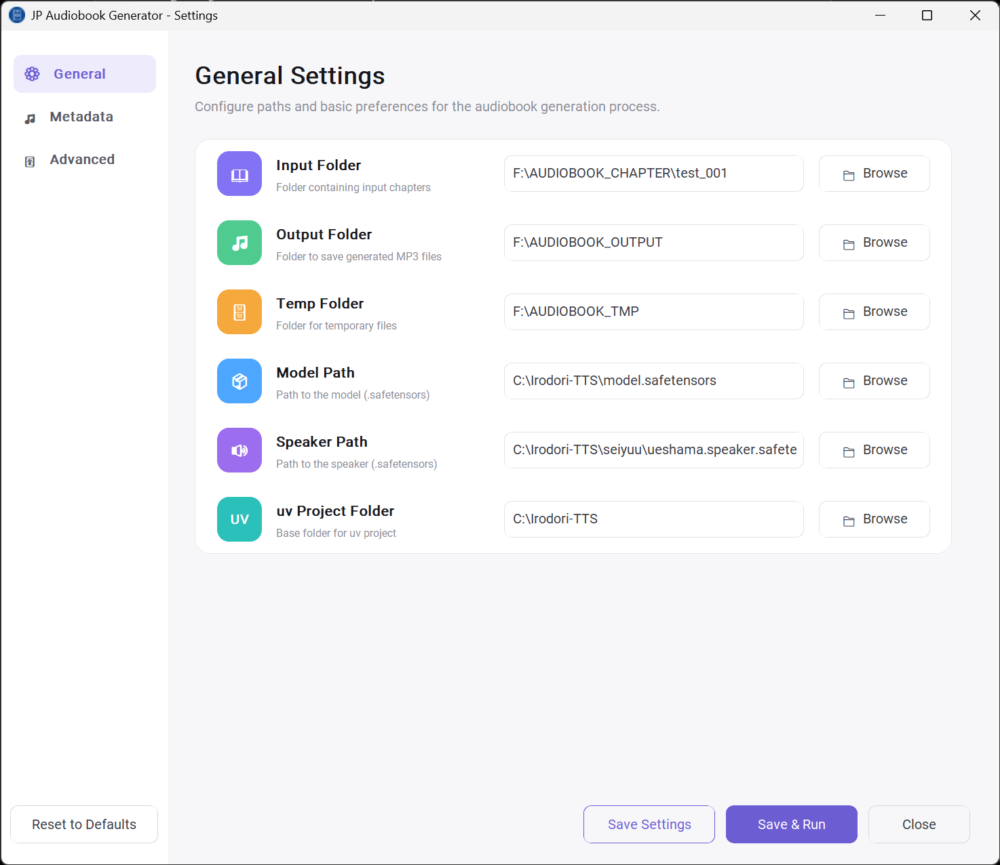
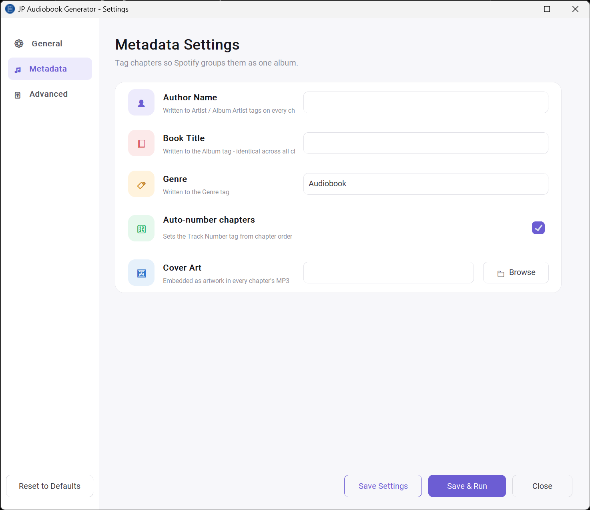
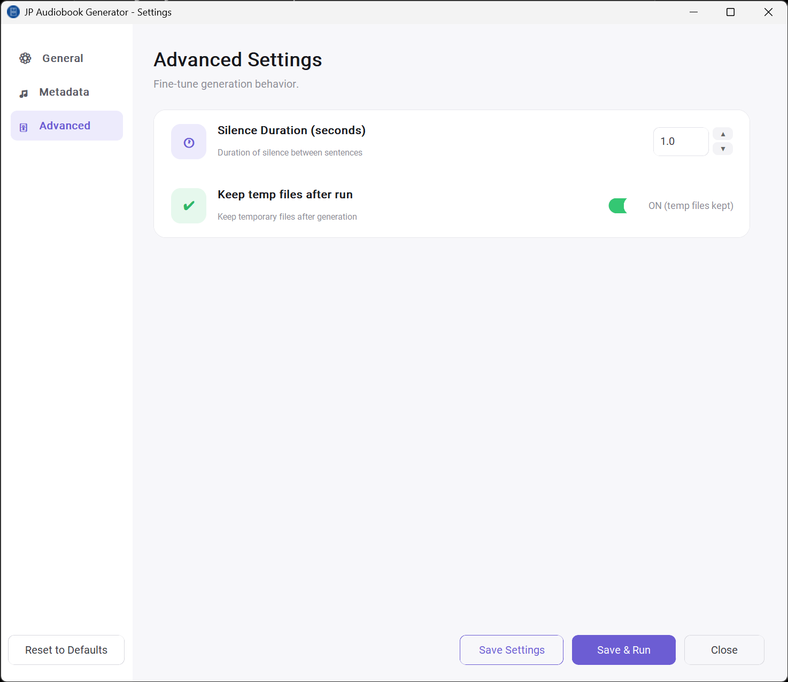

# JP-Audiobook-Generator
This script reads a raw txt file and output as an audio file in mp3 format.
<h1>🎧 Automated Japanese Audiobook Generator</h1>
<h2>1. Project Overview</h2>
The Automated Japanese Audiobook Generator is a Python automation pipeline designed to transform Japanese text into high-fidelity audiobooks. The system utilizes the Irodori-TTS engine to facilitate a seamless transition from raw textual data to polished, human-like narration. By automating the end-to-end lifecycle—including sophisticated linguistic pre-processing, sentence-level segmentation, and hardware-accelerated synthesis—this project provides a robust solution for local audiobook production.  
<h2>2. Core Functional Features</h2>
<b>Text Pre-processing: </b>The pipeline employs a sequential search-and-replace logic tailored for Japanese typography. It converts dialogue brackets (」) and ellipses (……) into conversational pauses (、) while preserving interrogative markers (？) to ensure the AI maintains correct tonal inflection.  
<b>Sentence-Level Chunking:</b> To respect model token limits and prevent prosodic degradation, the script segments text into manageable chunks using 。 and ？ as hard delimiters. This ensures high-quality intonation across long-form content.  
<b>AI Speech Synthesis:</b> The system integrates the Irodori-TTS engine, which utilizes a Flow Matching architecture for better voice quality. Local GPU inference is managed via the uv package manager to ensure environment stability.  
<b>Automated Audio Stitching:</b> Using FFmpeg’s filter_complex and the apad filter, the script merges individual sentence waveforms into a final chapter file. This process injects natural, configurable silence gaps to simulate human breathing and pacing.  
<h2>3. System Prerequisites</h2> 
<b>System Requirements</b> 
Operating System : Windows 11 
GPU : NVIDIA GeForce RTX 4060 (8GB VRAM minimum) 
Tools : FFmpeg (Full-shared version): Required for libtorchcodec DLL support. 
 uv: Modern Python package manager. 
Engine : Irodori-TTS (Cloned repository) 
Model Weights : model.safetensors (v4-Small recommended) and trained .speaker.safetensors (Semantic-DACVAE codec).  
YOU NEED TO PREPARE THE TRAINING MANIFEST AND PERFORM SPEAKER INVERSION  
Refer documentation on Irodori page. 
You need to convert your sample wav first via Training Manifest step: 
https://github.com/Aratako/Irodori-TTS#1-prepare-the-training-manifest 
Then you can proceed with Training your speaker using the output of the Training Manifest: 
https://github.com/Aratako/Irodori-TTS#2-train-v4-small 
https://github.com/Aratako/Irodori-TTS#4-speaker-inversion  

<h2>4. Environment Setup and GPU Verification</h2>
Follow these steps to initialize the hardware-accelerated environment: 
<b>Environment Synchronization: </b>Execute the following command in the project root to install dependencies with CUDA 12.8 support: 
uv sync --extra cu128  
<b>Hardware Verification: </b>Run the following command to confirm the RTX 4060 is correctly mapped to PyTorch: 
uv run python -c "import torch; print('GPU Available:', torch.cuda.is_available()); print('Device Name:', torch.cuda.get_device_name(0) if torch.cuda.is_available() else 'None')"  

<h2>5. Script Workflow Diagram</h2>
The following diagram visualizes the data path from ingestion to the final output: 

<h2>6. User Configuration Guide</h2>
<b>Settings GUI (Recommended)</b> 
A GUI (gui_settings.py) is now available so you no longer need to hand-edit run_audiobook.py for routine changes. Once set up, you can open it directly from the Windows taskbar: 
1. Run Create-Shortcut.ps1 once to create a desktop shortcut pointing to Launch-Settings-Silent.vbs. 
2. Pin that shortcut to the taskbar (right-click it → Pin to taskbar). 
3. Click the taskbar icon anytime to open the settings window, change values, and run the program without touching the terminal.  
Below is a look at the settings interface: 
 
 
 
 
Users must configure the absolute paths in the run_audiobook.py script. 
Note on Raw Strings: When defining Windows paths, you must use the r prefix (e.g., r"C:\Path"). This creates a "Raw String," preventing Python from interpreting backslashes as escape characters, a common cause of execution failure on Windows. 
--- Configuration --- 
Absolute paths for your environment (Modify for your local drive: C, D, or E) 
INPUT_FOLDER = r"E:\AUDIOBOOK\chapter"          # Source for chapter_*.txt 
OUTPUT_FOLDER = r"E:\AUDIOBOOK\output"        # Destination for final MP3s 
TEMP_DIR = r"D:\AUDIOBOOK_TMP"                # Working directory for audio chunks  

<b>AI Model Configuration</b> 
MODEL_PATH = r"C:\Irodori-TTS\model.safetensors" 
**Please use your SPEAKER INVERSION result 
SPEAKER_PATH = r"outputs/speaker_inversion/name/checkpoint_final.speaker.safetensors" 

<b>Narration settings</b> 
SILENCE_DURATION = 1.0  # Breath/pause (seconds) between sentences  

<h2>7. Detailed Text Cleaning Logic</h2>
To optimize text for the TTS engine, the script applies six sequential rules before final regex stripping. These rules must be executed in order to handle overlapping punctuation patterns: 
Ellipsis Conversion: Replace …… with a Japanese comma (、). 
Dialogue Bracket Conversion: Replace 」 with a Japanese comma (、). 
Double Comma Fix: Replace any resulting 、、 with a single 、 (occurs when a bracket followed an ellipsis). 
Interrogative Preservation: Explicitly retain ？ to guide the model's pitch-accent predictor. 
Trailing Bracket Cleanup: Use regex (？\s*、 -> ？) to remove redundant commas following question marks. 
Character Filtering: Strip all symbols except Japanese alphanumeric characters, 、, 。, and ？. 
Following these steps, the script uses re.split(r"([。？])", text) to ensure 。 and ？ act as hard boundaries for audio chunking.  
<h2>8. Execution and Deployment</h2>
<b>Running the Pipeline</b> 
Place your chapter files (e.g., chapter_01.txt) into the INPUT_FOLDER. 
Execute the automation script via the terminal using the execution guard: 
uv run --no-sync python run_audiobook.py

